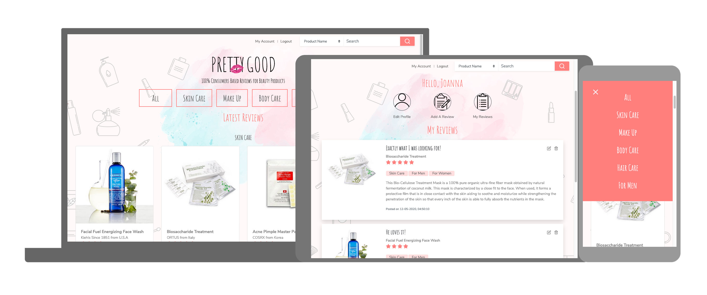

# Pretty Good 


**Pretty Good** is a informal website that allow consumers to freely post their honest reviews on any type of beauty products. The aim is to assure the audience that there's no paid review here. It serves as a information exchange platform. Users may read the reviews for free and without the needs to login. However, to add a review, registation and login are required so that the user may edit or delete their review(s) in the future.
 
You may access the deployed website from [here](https://beauty-reviews-app.herokuapp.com/)

## UX/UI
 
This website targets to girls/ladies who are looking for 100% consumers based reviews on beauty products including skin care, cosmetics, body care, hair care and also products for men. 

### User Stories:
- Susan, Female, 35, looking for skin foundation with good reviews for herself, she can perform a search for foundation with the search branch
- Alicia, Female, 26, looking for a present for her boyfriend, she can browse through the reviews by clicking on the Category "For Men" that appears on every page
- Jojo, Female, 25, likes to share her reviews of beauty products that she use, she can register herself and login to add a reviews

The wireframes and mockup of the website can be accessed here:
- For [Desktop](https://xd.adobe.com/view/b6c63e20-4de9-4ee9-6413-0442a04b7214-c0f7/) 
- For [Mobile](https://xd.adobe.com/view/6d136527-3e95-45ec-5ecf-4f18ca32edfb-1b22/)

The ER diagrams can be accessed [here](https://github.com/jolenewai/beauty_products_reviews/blob/master/static/images/readme/er_diagram.png)

### Navigation

- Users can access to the reviews of different categories by clicking on the main navigation that appears on each of the page. 
- Search bar, Login and Add A Review link are on sticky-top bar on the page which enable users to access to them at any point of the website

### Colour Scheme

Different shades of pink and black are used in this website as the intended users are mainly female.

### Typography
A mix of handwritten and sans serif fonts are used for this website, to achieve the goal of the casualness at the same time ensure the readability of contents.

- "Amatic SC", a handwritten style font is used in bigger font sizes for Headers, Navigation and Form Labels to make the website looks casual and less formal
- "Avenir", a sans serif font is used for other contents, as it has better readability on smaller font sizes


## Features

### Existing Features
#### Landing Page
Greeting users with choice of actions such as "Read Reviews" or "Write A Review", there's also option to login or register

#### Home Page
This will display the latest entries of reviews from each of the product category available


#### Navigate with Product categories
The main navigations for this website, allows user to access to the reviews for each product categories directly
- __All__, perform the same as the Home Page 
- __Skin Care__, displays all the reviews in "Skin Care" Category 
- __Cosmetics__, displays all the reviews in "Cosmetics" Category
- __Body Care__, displays all the reviews in "Body Care" Category 
- __Hair Care__, displays all the reviews in "Hair Care" Category
- __For Men__, displays all the reviews in "For Men" Category

Reviews that are belong to multiple categories will be displayed on both page, by default, the product categories are meant for women. Hence, there's a category "For Men" specifically meant for products that are targeting male audiences.

#### Search
The search bar is placed on top of every page and stick to top when user scrolls down. In the search bar, user can only perform basic search by selecting the search options: _Product Name_, _Product Brand_, _Keywords in the Review_. By default, this will search product name that matches user input. 

On the search result page, user can perform further filtering on the search results by limiting it to a specific _Product Category_ or _Rating_ or _Both_.


#### Login
User can login to perform the following task:
- [x] Add A Review
- [x] Edit Profile
- [x] Edit Review/s
- [x] Delete Review/s

#### Register
User can create an account before login to perform the abovementioned tasks

#### Add A Review
User can add a review to the website by filling up the form wit all the required fields

#### My Reviews
Reviews that were added by the login user will be listed here. User can edit or delete the reviews from this page

#### Edit Profile
User can edit their personal information that was filled in during the registration

#### Review Details
Each review will have an indiviual page that displays every single details 

#### Features Left to Implement
- To allow users to change the sorting of the reviews (currently it's sorted automatically by Descending order of Posted Date)
- To allow users to edit/delete their review/s from any page after they have login
- Lazy loading of the reviews

## Technologies Used

* HTML 
* CSS
* Javascript 
* [JQuery](https://jquery.com/) to simplify DOM manipulation
* [Bootstrap version 4.4](https://getbootstrap.com/) for toggle of tabs navigation  
* [MongoDB Atlas](https://www.mongodb.com/cloud/atlas) for storing data on database 
* [Flask version 1.1.2](https://flask.palletsprojects.com/en/1.1.x/) to create this appears
* [Flask-Login](https://flask-login.readthedocs.io/en/latest/) for basic user authentications
* [pymongo](https://pymongo.readthedocs.io/en/stable/) to communicate with MongoDB in Python
* [GitHub](https://github.com/) for versioning control


### Software
* [Adobe XD](https://www.adobe.com/sea/products/xd.html) for wireframing and UI design 
* [Adobe Photoshop](https://www.adobe.com/sea/products/photoshop.html) for photos editing and cropping
* [Adobe Illustrator](https://www.adobe.com/sea/products/illustrator.html) to create background images


## Plugins

* Animate on Scroll [AOS](https://michalsnik.github.io/aos/) for animations on the cards
* [Uploadcare API](https://uploadcare.com/) for uploading images on a separate cloud

## Testing

A testing account is created to perform the following testing:

```
Email : abc@test.com
Password : testing@testing
```

### User Registration
- [x] On the home page, click on Register
- [x] Try to submit the empty form and verify that error messages about the required fields appear and highlighted in red
- [x] Try to submit the form with an existing email address on the database and verify that the registration will be rejected to preserve the uniqueness of the email in the database

### Login 
- [x] On one of the review page, click on Login
- [x] Try to submit the empty form and verify that error messages about the required fields appear and highlighted in red
- [x] Try to submit the form with an invalid email address and verify that it is an invalid login
- [x] Try to submit the form with a wrong password and verify that it is an invalid login
- [x] Try to submit the form with all inputs valid and verify that the redirection is successful and on the top bar it changes "Login" to "Logout"

### Add A Review (before login)
- [x] On home page, click on Write A Review
- [x] The page will be redirected to Login
- [x] Repeat steps in Login testing

### Add A Review (after login)
- [x] On one of the review page, click on My Account, then Add A Review on My Account Page
- [x] Try to submit the empty form and verify that error messages about the required fields appear and highlighted in red
- [x] Try to submit the form with all inputs valid and verify the review has been added when redirected to My Reviews page

### Update A Review 
- [x] On My Reivews page, click on the edit icon beside the title of the review
- [x] Verify that information from the database are presented in the form inputs, try to change one of the field and verify that the field is updated after submit the form
- [x] Try to change image and submit and verify that the image is updated after submit the form

### Delete A Review
- [x] On My Reviews page, click on the delete icon beside the title of the review
- [x] Verify that confirmation message is displayed and try to press confirm and verify that the review is deleted when redirected to My Reviews page

### Update Profile
- [x] On My Account page, click on the Update Profile link in login user section
- [x] Verify that information from the database are presented in the form inputs, try to change one of the field and verify that the field is updated after submit the form
- [x] Try to change image and submit and verify that the image is updated after submit the for

### Search 
- [x] On one of the review page, type in any keyword in the search bar, choose one of the search options from the select box, repeat with the other 2 options and verify that the matching results appear in Search Result page
- [x] On Search Result page, apply filter with one of the product category and rating, and verify that the matching results displayed

### Browsing Reviews by Category on Main Navigation
- [x] Click on each button and verify that the matching reviews are displayed

### Responsivenesss
- [x] This website is responsive on various devices such as Desktop, iPad (works better in vertical), Mobile Phone

### HTML validation
- [x] [FREEFORMATTER](https://www.freeformatter.com/html-validator.html)
- [x] [validator.nu](https://html5.validator.nu/)

### Unsolved bugs/problems 
- [ ] Bootstrap form validation unable to enforce at least one of the multiple checkboxes to be selected
- [ ] Product name is not able to be enforced to standardised, for example, different user will enter a different name for the same product, this problem is not resolveable unless we build a database with all the products stored on the database.
- [ ] There's horizontal overflow on the page that displays all the product categories on iPad horizontal format due to the size of the card column


## Deployment

This website is deployed on [Heroku](https://www.heroku.com). 
The URL for the deployed website is https://beauty-reviews-app.herokuapp.com/

To deploy on Heroku
1. Download or Clone the master branch from [github](https://github.com/jolenewai/beauty_products_reviews)
2. To list all the requirements in requirements.txt, run the following command in terminal:
```
pip3 freeze --local > requirements.txt
```
3. Set Debug to False
4. Procfile need to be created to run gunicorn upon deployment
5. Git push to Heroku Master after all the documents are properly set up
5. All public keys and private keys for the following need to be added to in Heroku Config Vars settings:
    - Uploadcare API
    - MongoDB URI
    - Dabatase Name : beauty_products_review

## File Hierarchy and Organisation

Files are organised properly based on their functionality and purposes.
- __static__ folder contains images / css / scripts required by the website, in their respective folders
- __templates__ folder contains all html templates with jinja codes to render the display of the information from the database 
- python codes are also splitted into different files _app.py_, _dao.py_ and _data.py_ accordingly based on their functionality

## Credits

### Content
- The text for the reviews was copied from the [MakeupAlley](https://www.makeupalley.com/)

### Media
- The photos used in this site were obtained from [MakeupAlley](https://www.makeupalley.com/)
- The vector graphics used in the background were obtained from [Freepik](https://www.freepik.com/)
- The screenshot is created using [Material.io Resizer](https://material.io/resources/resizer/)
- The favicon is created using [favicon.io](https://favicon.io/)

### Acknowledgements
I received inspiration for this project from
- [MakeupAlley](https://www.makeupalley.com/)
- [BeautyPedia](https://www.beautypedia.com/)
